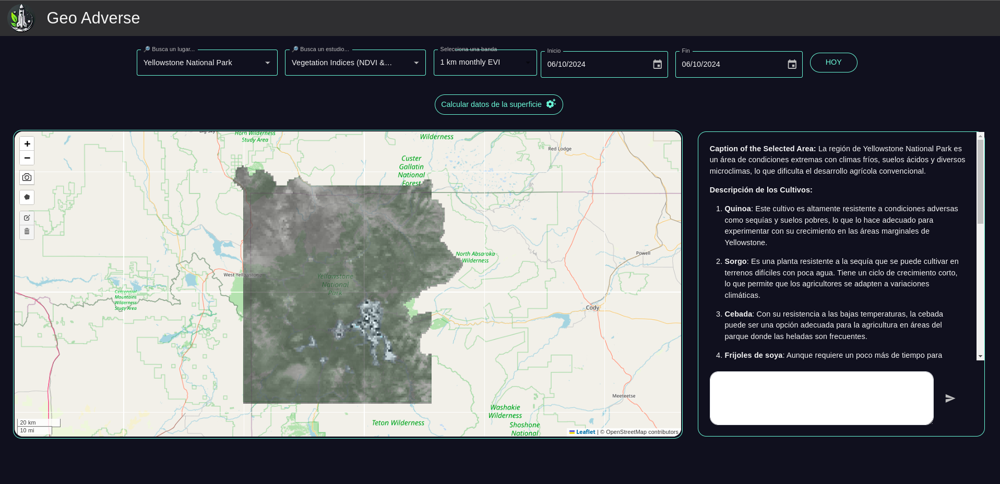

 

  
  <h1 align="center">
  <b>
    Geo Adverse v0.1
  </b>
  </h1>

  
Hostile environment agricultural companion

</img>

## Built With

* [Node.js](https://nodejs.org/en/)
* [React.js](https://reactjs.org/)
* [MUI v5](https://mui.com/)
* [React-Bootstrap](https://react-bootstrap.netlify.app/)
* [Fastapi](https://fastapi.tiangolo.com)

# Roadmap
  [Project Guidelines](https://docs.google.com/document/d/1a-rDKZboWiFkpIl8g3wewjC4FUXtSlUnzic_YRSvRKk/edit?usp=sharing)

- [x] General sections of the web interface
- [x] Add results and visualizations
- [x] Add 'export as PNG' option
- [x] Add chatGPT integration
- [x] Add backend support
- [ ] Cloud deployment
- [ ] Multi-language Support
    - [x] Spanish
    - [ ] English

----

# How to run ?

This project was bootstrapped with [Create React App](https://github.com/facebook/create-react-app).

## Frontend

`cd geo-tool-frontend`

Requirements:

* Node 18

In this directory you can the backend api, you need a `.env` file with the following environment variables:

* `REACT_APP_PUBLIC_MAPS_KEY` - google maps api key (if needed to display google source)
* `REACT_APP_API_URL` - url for backend api

### Available Scripts

In the project directory, you can run:

`npm install` - to install the frontend (node.js 18+)

 `npm start` - to run the app in the development mode. Open [http://localhost:3000](http://localhost:3000) to view it in your browser.
The page will reload when you make changes. You may also see any lint errors in the console.

## Backend

`cd geo-tool-api`

Requirements:

* Python3.10
* Pip3
* Python3.10-venv (or any environment manager)
* Docker

In this directory you can the backend api, you need a `.env` file with the following environment variables:

* `EARTHDATA_USERNAME`
* `EARTHDATA_PASSWORD`
* `EARTHDATA_API_URL`
* `OPEN_API_KEY`

There is a makefile to run the backend locally with the following commands:

* `make create` - to create the virtual environment
* `make activate` - to activate the venv
* `make install` - to install the project libraries
* `make run-dev` - to run the environment

To run with docker simply do `docker compose up --build`

(<a href="#top">back to top</a>)

